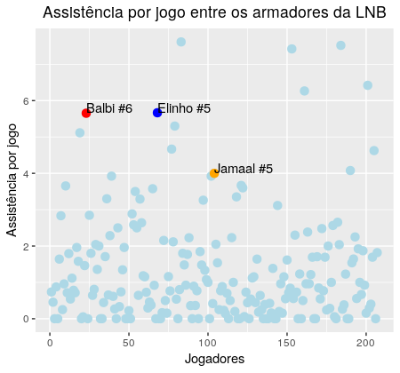
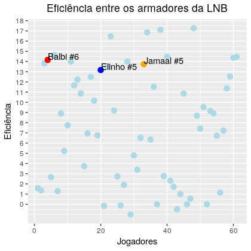
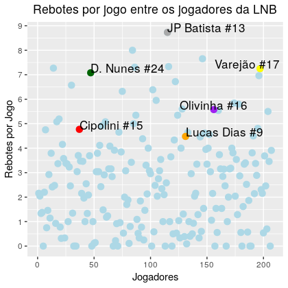
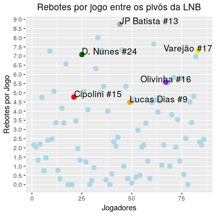
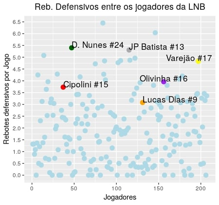
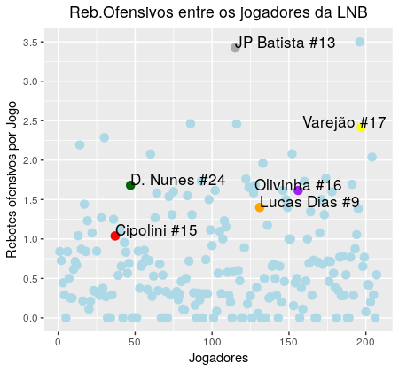
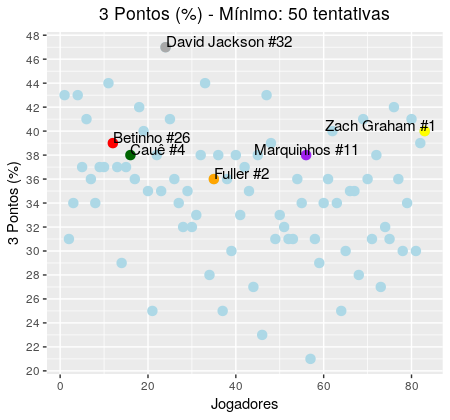

   A [Liga Nacional de Basquete](http://lnb.com.br/) realiza, ao fim de cada temporada, uma premiação 'Melhores do Ano' em diversas categorias. Para garantir que a escolha seja 'justa', é preciso alinhar o 'olhômetro' aos dados. Para fazer as análises necessárias, foram utilizadas várias estatísticas para cada categoria, mas todas seguem a mesma lógica. 
   
   Vale a pena ressaltar que as estatísticas foram coletadas no site da NBB. Para quem tiver interesse na área de programação e nas técnicas de web-scrapping, o [post da análise dos jogadores](https://pedrohcrocha.github.io/web-scrape-lnb) apresenta os passos necessários para extrair os dados usando a linguagem de programação R. 
  Sem mais delongas, vamos dar início as seleções.
  
Melhor Sexto Homem
=====
Os concorrentes nessa categoria são: [Alexey #4](http://lnb.com.br/atletas/alexey-thiago-pereira-borges/), da Equipe Sesi/Franca, [Didi #7](http://lnb.com.br/atletas/marcos-henrique-lousada-silva/), também do Sesi/Franca e [Davi #5](http://lnb.com.br/atletas/davi-rossetto-de-oliveira-athayde/), do Flamengo.
   
   A equipe do Flamengo possui um excelente armador em Balbi #6 e um bom ala/armador em Deryk #9. Já a equipe do Sesi/Franca
também possui Elinho #5 comandando o time na posição de armador e David Jackson #32, talvez um dos melhores jogadores da liga, na posição de ala/armador. Assim, o critério principal para a seleção de *Melhor Sexto Homem* deve ser o quão bem o jogador que vem do banco consegue preencher o espaço dos astros em sua posição.

  Para isso, temos uma estatística chamada **Plus/Minus**. O Plus/Minus mede a diferença de pontuação quando jogador estava em quadra. 
| Jogador   | Equipe      | Jogos | Min/JO | Posição | Idade | PlusMinus |
|-----------|-------------|-------|--------|---------|-------|-----------|
| Alexey #4 | Sesi Franca | 26    | 21.00  | Armador | 24    | 5.222222  |
| Davi #5   | Flamengo    | 26    | 20.35  | Armador | 27    | 6.702703  |
| Didi #7   | Sesi Franca | 22    | 20.32  | Ala     | 20    | 4.031250  |
  
  Todos os candidatos jogam aproximadamente 21 minutos por jogos e jogaram a mesma quantidade de jogos, exceto Didi #7, que perdeu alguns jogo devido a uma lesão. No quesito Plus/Minus, quem leva a vantagem é Davi #5, do flamengo. 
  
  Porém, devemos olhar para outras estatísticas para fundamentar a decisão. Uma maneira de sumarizar várias medidas é usando as estatísticas avançadas. Uma boa estatística para avaliar o sexto homem é Usage Rate (UR), métrica que avalia o quanto da atividade de um time envolve um jogador. Pela tabela abaixo, Didi #7 possui o maior Usage Rate, no 85º percentil. Porém, isso é não algo positivo, pois jogadores com mesmo UR, tais como Balbi #6, do Flamengo, com um UR de 21.59 e JP Batista #13, de Mogi, com 21.22 de Usage Rate têm produção muito superior que a de Didi #7. 
  
| Jogador   | Equipe      | Jogos | Min/JO | Posição | Idade | UR    | Percentil |
|-----------|-------------|-------|--------|---------|-------|-------|-----------|
| Alexey #4 | Sesi Franca | 26    | 21.00  | Armador | 24    | 16.39 | 45.04     |
| Davi #5   | Flamengo    | 26    | 20.35  | Armador | 27    | 15.03 | 29.07     |
| Didi #7   | Sesi Franca | 22    | 20.32  | Ala     | 20    | 21.28 | 85.14     |
 
  A eficiência será o último critério de seleção. Esta estatística dará a informação sobre a performance do jogador em relação a todas as estatísticas básicas (Pontos, Rebotes, Assistências, Tocos e Bolas roubadas). Alexey #4, nesse quesito, foi o melhor colocado, ocupando o 73º percentil. Para efeito de comparação, Alex Garcia #10, da equipe Bauru, tem um EFF de 9.91.
 
| Jogador   | Equipe      | Jogos | Min/JO | Posição | Idade | EFF   | Percentil |
|-----------|-------------|-------|--------|---------|-------|-------|-----------|
| Alexey #4 | Sesi Franca | 26    | 21.00  | Armador | 24    | 10.69 | 73.42     |
| Davi #5   | Flamengo    | 26    | 20.35  | Armador | 27    | 6.96  | 54.10     |
| Didi #7   | Sesi Franca | 22    | 20.32  | Ala     | 20    | 9.04  | 65.70     |
  
  Se isso fosse uma redação do ENEM, eu começaria com 'Portanto, etc ...'. Mas, como não é, o meu voto vai para  **Alexey #4** para Melhor Sexto Homem do ano. Ele teve o 2º melhor Plus/Minus, o 2º maior Usage Rate, a melhor eficência entre os candidatos, bem como, para quem assistiu ele jogar durante o ano, uma postura de armador titular em quadra. 
  
Melhor Armador
======
   A seleção de melhor armador necessita de uma análise um pouco mais profunda. O papel de um armador é organizar a equipe, tanto no ataque, quanto da defesa e esse perfil de liderança não é observável nos dados. Para isso, devemos comparar com o restante da liga. 
   
   Nesse quesito, temos os competidores: [Balbi #6](http://lnb.com.br/atletas/franco-nicolas-balbi/), do Flamengo, [Elinho #5](http://lnb.com.br/atletas/elio-corazza-neto/), de Sesi/Franca e [Jamaal #5](http://lnb.com.br/atletas/jamaal-thaddius-smith/), do Botafogo. 
   
   Para começar a analisar os armadores na disputa, um bom caminho é compararmos a estatística pela qual os armadores são conhecidos, a *assistência*. 
   
   Pelo gráfico, vemos que a corrida nesse quesito é acirrada. Balbi #6 e Elinho #5 estão quase empatado devido, em grande parte, de jogarem em times com outros jogadores excepcionais (Flamengo e Franca disputaram a final da NBB desta temporada). Jamaal #5, apesar do Botafogo ter alcançado as semi-finais, não joga com um grupo cheio de talentos, como as equipes dos outros concorrentes. 
   
   

   Um bom armador é eficiente. Não apenas em relação as suas decisões de passe, mas em todos os aspectos que o rodeiam durante o jogo. Assim, a estatística *Eficiência* é uma boa métrica para avaliar os candidatos. Filtrando o gráfico apenas para os armadores e ala/armadores - 61 jogadores -, os candidatos à premiação encontram-se muito bem colocados. Balbi #6, Jamaal #5 e Elinho #5 ocupam 86º, 80º e 77º percentils, respectivamente, no quesito Eficiência entre os armadores da liga. 
   
   
   
   Felizmente, as equipes dos armadores se enfretaram nesses playoffs. Podemos ver os resultados gerados por esses duelos.
 Jamaal #5 foi um dos melhores jogadores desses playoffs e as suas médias mostram isso. No entanto, Balbi #6 e o Flamengo não ficaram atrás e conquistaram o título em cima das equipes dos outros concorrentes. Elinho #5 misturou uma série de boas e más atuações. 
   
| Jogador   | Duelo     | Jogos | Min/JO | PTS   | AST | REB  | BR   | ER   | 3P%   | 2P%   | LL%   | PM    | EF    |
|-----------|-----------|:-----:|--------|-------|-----|------|------|------|-------|-------|-------|-------|-------|
| Jamaal #5 | Balbi #6  |   4   | 34.34  | 19.00 | 4.5 | 2.25 | 1.75 | 1.75 | 37.00 | 34.50 | 87.50 | -4.25 | 19.25 |
| Balbi #6  | Jamaal #5 |   4   | 27.05  | 10.50 | 6.0 | 3.75 | 0.75 | 2.25 | 35.00 | 33.25 | 100   | 7.75  | 15.00 |
| Balbi #6  | Elinho #5 |   5   | 26.44  | 12.6  | 5.2 | 5.4  | 2.4  | 1.2  | 30.8  | 38.0  | 100   | 6.8   | 12.00 |
| Elinho #5 | Balbi #6  |   5   | 25.12  | 9.6   | 5.0 | 4.6  | 0.4  | 1.6  | 28.0  | 26.6  | 100   | -5.4  | 2.8   |
   
   Nesse quesito, não há disputa. Meu voto de Melhor Armador do Ano vai para **Balbi #6**. Mostrou-se, durante a temporada, um armador consistente com boas qualidades ofensivas e defensivas, capaz de liderar uma equipe campeã. Porém, isso não é desmérito à **Jamaal #5**, que apresentou uma evolução absurda nesta pós-temporada e também é merecedor de uma menção honrosa. 
   
Melhor Estrangeiro
=======   
   Nos últimos anos, a NBB recebeu muitos jogadores de diversas nacionalidades, especialmente os norte-americanos. Já alguns estão na Liga fazem anos e muitos desses talentossão de  outros países. Alguns deles quebraram [recordes](http://lnb.com.br/nbb/recordes/), como Shammel #8, jogador da equipe Mogi, que é o maior pontuador da história da NBB e natural dos Estados Unidos.
   
   Os jogadores disputando essa categoria são: [Balbi #6](http://lnb.com.br/atletas/franco-nicolas-balbi/), já conhecido, [David Jackson #32](http://lnb.com.br/atletas/david-wayne-jackson-jr/), do Sesi/Franca e [Fuller #2](http://lnb.com.br/atletas/kyle-alejandro-fuller/), da equipe do Corinthians.
   Avaliando as estatísticas médias da temporada, vemos que Fuller #2 liderou a liga em pontuação, o que é impressionante por si só. Mas David Jackson #32, com 37 anos de idade, ter em média 17.37 pontos também não é algo para se ignorar. Já Balbi #6 é, de longe, o melhor roubador de bolas entre os três e também o que tem o maior número de assistências. 
   

| Jogador           | Equipe      | Jogos | Posição     | Idade | Min/JO | Pts/JO | Ast/JO | Reb/JO | BR/JO | ER/JO |
|-------------------|-------------|:-----:|-------------|-------|--------|--------|--------|--------|-------|-------|
| Balbi #6          | Flamengo    |   26  | Armador     | 30    | 24.35  | 10.26  | 5.65   | 3.57   | 1.80  | 2.03  |
| David Jackson #32 | Sesi/Franca |   24  | Ala/Armador | 37    | 29.66  | 17.37  | 2.58   | 3.79   | 1.08  | 1.25  |
| Fuller #2         | Corinthians |   26  | Ala         | 27    | 32.34  | 21.30  | 2.11   | 3.07   | 1.03  | 1.79  |

   Todos os candidatos tiveram temporadas espetaculares, mas, pelo fato dessa categoria ser bem menos homogênea que as outras, não é fácil encontrar medidas que justifiquem uma seleção justa. O critério de avaliação aqui será a *evolução* do jogador e contribuição para a Liga como um todo, e poucos jogadores evoluiram tanto quanto *Fuller #2*. 
   
   Todas as estatísticas tiveram um aumento considerável, especialmente na média de pontos, e é por isso que meu voto de  Melhor Estrangeiro do Ano vai para **Fuller #2**.
   
| Temporada           | Equipe | JO | Min  | Pts  | Reb | Ast | 3P%  | 2P%  | LL%  | BR  |
|---------------------|--------|----|------|------|-----|-----|------|------|------|-----|
| NBB CAIXA 2017/2018 | CAP    | 41 | 22.6 | 11.0 | 2   | 1.5 | 31.3 | 42.7 | 82.3 | 0.6 |
| NBB CAIXA 2018/2019 | COR    | 32 | 32.8 | 20.7 | 3   | 2.0 | 35.7 | 45.3 | 88.0 | 1.0 |
  
  
Melhor Pivô
======  
   A categoria de 'Melhor Pivô do Ano' possui o maior número de candidatos. Os classificados são: [Cipolini #15](http://lnb.com.br/atletas/lucas-cipolini-alves/) e [Lucas Dias #9](http://lnb.com.br/atletas/lucas-dias-silva/), do Sesi/Franca; [Olivinha #16](http://lnb.com.br/atletas/carlos-alexandre-rodrigues-do-nascimento/) e [Varejão #17](http://lnb.com.br/atletas/anderson-franca-varejao/), ambos do Flamengo; [JP Batista #13](http://lnb.com.br/atletas/joao-paulo-lopes-batista/), de Mogi, e [D.Nunes #24](http://lnb.com.br/atletas/douglas-angelo-nunes/), de São José.
   
   Essa disputa agrega vários estilos de jogos diferentes. JP Batista #13 e Varejão #17 ocupando o espaço do pivô 5 tradicional, conhecido pelo alto volume de rebotes e por jogar na região do garrafão no ataque. Já Lucas Dias #9 e Olivinha #16 possuem um estilo mais parecido com de um ala/pivô, o famoso pivô 4, jogando com maior frequência na região fora do arco dos três pontos. E Cipolini #15 e D.Nunes #24 mesclam um pouco dos dois estilos, comparando-se a um estilo de pivô mais moderno. 
   
   Porém, indiscutivelmente, um pivô deve pegar *rebotes*. Avaliando o número total de rebotes entre os jogadores da LNB nessa temporada, todos os candidatos encontram-se acima do 80º percentil. O percentil mais inferior é o de Lucas Dias #9, no 83º percentil e o máximo é JP Batista #13, que liderou a liga em rebotes. 
   
   
   
   E, entre os pivôs da Liga, o perfil já se altera. Lucas Dias #13 desce para o 68º percentil, seguido de Cipolini #15, no 75º percentil. Olivinha #16 fica no 84º percentil, enquanto que D.Nunes #24 e Varejão #17 encontram-se no 91º e 93º percentils, respectivamente.
   
   
   
   Filtrando para rebote defensivos, JP Batista #13 e D.Nunes #24 estão na liderança entre os candidatos, com aproximadamente 5.5 rebotes defensivos por jogo.
   
   
   
   Nos rebotes ofensivos, JP Batista #13 é o 1º lugar entre os outros concorrentes e 2º na liga, atrás apenas de Toledo #13, da equipe de Pinheiros. 
   
   
   
   É também de se esperar que um pivô projeta o garrafão, sendo, na maioria dos casos, a última linha de defesa de um time. Para isso, *tocos* são uma estatística simples mas que informa bastante sobre posicionamento defensivo, tempo de bola e habilidade defensiva.
   
   Entre os jogadores da Liga, a maioria dos concorrentes estão acima do 80º percentil, exceto Olivinha #16, porém, neste caso, devemos ter uma visão além do dados. Varejão #17, que também joga no Flamengo, ocupa essa função de 'protetor do garrafão', enquanto o papel de Olivinha #16 é ser um defensor mais versátil, capaz de marcar tanto pivôs e quanto ala/armadores, muito parecido com [Draymond Green](https://pt.wikipedia.org/wiki/Draymond_Green). 
   
| Jogador        | Equipe      | Min/JO | Idade | Faltas/JO | TO/JO | Percentil |
|----------------|-------------|--------|-------|-----------|-------|-----------|
| Cipolini #15   | Sesi Franca | 23.46  | 33    | 2.04      | 0.27  | 79.71     |
| D. Nunes #24   | São José    | 31.76  | 32    | 2.56      | 0.52  | 92.27     |
| JP Batista #13 | Mogi        | 31.38  | 38    | 2.54      | 0.57  | 94.20     |
| Lucas Dias #9  | Sesi Franca | 30.48  | 24    | 2.56      | 0.96  | 97.58     |
| Olivinha #16   | Flamengo    | 19.50  | 36    | 1.54      | 0.07  | 51.69     |
| Varejão #17    | Flamengo    | 19.54  | 37    | 2.04      | 0.37  | 88.40     |

   Para tentar captar as estatísticas do modelo de pivô moderno, que joga dentro do garrafão, participa de corta-luz com frequência, mas que também joga bastante na linha dos 3, devemos utilizar a estatística avançada *Effective Field Goal Percentage*, ou *porcentagem de arremesso efetiva*. Para entender como ela funciona, imagine um jogador X acerta 4 de 10 arremessos, com 2 acertos de 3 pontos e 2 acertos de 2 pontos. Logo, 6 pontos vindos de arremessos da linha de 3 e 4 pontos vindo de arremessos de 2 pontos, totalizando 10 pontos. Agora, imagine outro jogador Y acerta 5 de 10 arremessos e os 5 acertos foram da área de 2 pontos. Assim, cada jogador teria 10 pontos para 10 arremessos e, logo, a mesma porcentagem de pontos por arremesso, isto é, a mesma effective field goal percentage. Para ver mais, veja a outra [postagem](https://pedrohcrocha.github.io/web-scrape-lnb).
   
   Cipolini #15 lidera os candidatos, ocupando o 96º percentil entre os jogadores da liga e o 97º percentil. Olivinha #16 e Lucas Dias #9, jogadores que tradicionalmente operam fora da linha dos 3, tem altos EFG%. No entanto, JP Batista #13, que arremessou apenas três bolas de 3 pontos durante a temporada, estar no 90º percentil entre os jogadores da liga é impressionante.
   E é por isso e por todos os outros critérios que meu voto para *Melhor Pivô do Ano* vai para **JP Batista #13**. Como ganhador do segundo posto de *Melhor Pivô do Ano*, meu voto vai para **Lucas Dias #9**, pelo enorme potencial que ele demonstrou ter e pelo papel que ele desempenhou na equipe de Sesi/Franca. 

| Jogador        | Equipe      | JO  | EFG (%) | Percentil (Liga) | Percentil (Pivôs) |
|----------------|-------------|-----|---------|:----------------:|:-----------------:|
| Cipolini #15   | Sesi Franca | 26  | 62.56   |       96.52      |       97.77       |
| D. Nunes #24   | São José    | 25  | 54.50   |       67.82      |       71.11       |
| JP Batista #13 | Mogi        | 26  | 58.33   |       90.43      |       91.11       |
| Lucas Dias #9  | Sesi Franca | 25  | 59.02   |       93.91      |       93.33       |
| Olivinha #16   | Flamengo    | 26  | 57.91   |       89.56      |       88.88       |
| Varejão #17    | Flamengo    | 24  | 50.27   |       40.00      |       42.22       |

Melhor Ala 
======
   A posição de *ala* é conhecido por aglomerar os grandes pontuadores de qualquer liga de basquete. E na NBB, não é diferente. A disputa de Melhor Ala do Ano é recheada de veteranos, com apenas um novato. Os concorrentes são: [Betinho #26](http://lnb.com.br/atletas/jos%C3%A9-roberto-nardi-duarte/), [Cauê #4](http://lnb.com.br/atletas/cau%C3%AA-borges-dos-santos/), [David Jackson #32](http://lnb.com.br/atletas/david-wayne-jackson-jr/), [Fuller #2](http://lnb.com.br/atletas/kyle-alejandro-fuller/), [Marquinhos #11](http://lnb.com.br/atletas/marcus-vinicius-vieira-de-sousa/) e [Zach Graham #1](http://lnb.com.br/atletas/zachary-darnell-graham/).
   
   Verificando os *pontos por jogo*, salta aos olhos a similaridade do basquete brasileiro em relação as outras ligas internacionais no que diz respeito da pontuação vinda dos alas. Todos, exceto Betinho #26, encontram-se na casa do 90º percentil. Entre os concorrentes, temos Fuller #2 liderando a liga em pontos e Zach Graham #1 vindo em 2º lugar. Outro padrão evidente é a idade dos concorrentes; o grupo tem idade média de 34 anos, não que isso importe muito. 
   
| Jogador           | Equipe      | Min/JO | Idade | PTS/JO | Percentil |
|-------------------|-------------|--------|-------|--------|-----------|
| Betinho #26       | Pinheiros   | 21.80  | 40    | 11.84  | 80.67633  |
| Cauê #4           | Botafogo    | 34.20  | 31    | 13.95  | 91.78744  |
| David Jackson #32 | Sesi Franca | 29.66  | 37    | 17.37  | 98.55072  |
| Fuller #2         | Corinthians | 32.34  | 27    | 21.30  | 100.00000 |
| Marquinhos #11    | Flamengo    | 26.92  | 40    | 15.42  | 94.20290  |
| Zach Graham #1    | Brasília    | 36.31  | 30    | 19.13  | 99.03382  |

   No basquete moderno, um ala deve ter em seu arsenal ofensivo um bom chute da linha de três pontos. Um ala que tem esse artifício abre o espaço na quadra, permitindo que o armador ou ala/armador possa infiltrar com mais facilidade, como também ajuda o pivô a jogar na área do garrafão sem ter o perigo constante de dobrar a marcação nele. 
   
   Entre os jogadores que arremessaram mais que 50 bolas de três durante a temporada, David Jackson #32 lidera absoluto com uma (ridícula) porcentagem de 47% dos três pontos. A maioria dos candidatos, como a restante do grupo selecionado, encontra-se na faixa de 32% e 38%. 
   
   
   
   Outra métrica importante de ser analisada no caso dos alas é a *True Shooting (TS)*, ou, *Verdadeiro Arremesso*. Ela avalia a eficiência de todos tipos de arremessos, seja de 2 pontos, 3 pontos ou lances livres. Do ponto de vista técnico, uma medida alta de True Shooting indica que o jogador escolhe arremessos de alta porcentagem e os converte com frequência, isto é, no linguajar do basquete, não "força" cestas em situações difíceis com marcação apertada.
   
   Filtrando para jogadores com pelo menos 20 jogos na temporada, David Jackson #32 lidera o grupo, mas Marquinhos #11 vem logo em seguida, com 62% de True Shooting.
   
   
   
   Na ausência de estatísticas mais específicas da área defensiva, meu voto para *Melhor Ala do Ano* vai para **David Jackson #32**, pela incrível temporada em termos de eficiência - 2º lugar na Liga-, eficácia em arremesso e contribuição tanto ofensiva quanto defensiva para a equipe de Franca. Tudo isso com 37 anos de idade! O segundo voto vai para **Marquinhos #11**, que teve uma boa temporada regular e uma pós-temporada fantástica.
   
   Existem outras categorias na votação de 'Melhor de Ano' que não terão uma análise mais detalhada. Então, todos os votos a partir daqui representarão uma opinião pessoal de espectador:
   
   **Defensor do ano**: Jimmy #18 (Sesi/Franca), **Mineiro #12 (Flamengo)**, Bennet #3 (Pinheiros)
   
   **Destaque Jovem**: Didi #7 (Sesi/Franca), Ruivo #4 (Pinheiros) , **Yago #2 (Paulistano)**
   
   **Técnico do Ano**: **Gustavo de Conti (Flamengo)**, Helinho Garcia (Sesi/Franca), Léo Figueiró (Botafogo)
   
   Na escolha de ['Melhor Jogador da Temporada'](https://www.instagram.com/p/BxAx2SGArIS/?utm_source=ig_embed)(MVP), a disputa é acirrada. Por um lado, temos um recém-chegado da liga em Balbi #6 e dois veteranos, JP Batista #13 e DJ #32. Por ser um 'rosto novo' e ter um estilo de jogo esteticamente prazeroso e eficiente, Balbi #6 talvez leve vantagem na corrida. No geral, ele teve uma boa temporada. Mas as temporadas de DJ #32 e JP #13 foram bem superiores, em termos de estatísticas e eficiência, do que a de Balbi #6, o que o exclui da votação.
   Assim, entre JP Batista #13 e David Jackson #32, meu voto vai para **JP Batista #13**, pela alto nível e consistência durante a temporada.
   
   **MVP da temporada** : **JP Batista #13 (Mogi)**, David Jackson #32 (Sesi/Franca), Balbi #6 (Flamengo)

   
