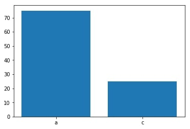
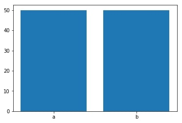

Recentemente, assisti um [vídeo](https://www.youtube.com/watch?v=B7l0eSQO9dM) no qual o participante da jogo "Quem quer ser um milionário?" estava na pergunta de 1 milhão. Ele ainda possuía duas ajudas: Pergunte a audiência e 50/50. Em algum momento, o participante até brinca com o apresentador sobre qual ajuda ele deveria pedir primeiro. O apresentador aconselha 50/50 e, depois, perguntar a audiência, pois discartaria as alternativas erradas e ajudaria a resposta correta ser a mais escolhida. O participante, porém, argumenta que é melhor pedir ajuda a audiência e, depois, solicitar o 50/50, pois distribuiria as respostas erradas por mais alternativas, sobrando a resposta correta como mais votos.

Ambas as escolhas fazem sentido, no entanto, qual delas é melhor estatisticamente? Para realizar uma análise desse tipo, é preciso 
supor algumas premissas, formular proposições e realizar milhares de simulações para tentar, no limite, retratar a um cenário no mundo real.

As premissas assumidas são:

**1** - *O jogador sabe ou não sabe a resposta;*

**2** - *A resposta de de um participante não tem influência sobre a resposta de outro. (Respostas independentes);*

**3** - *Todos os participantes da audiência que sabem a resposta, respondem corretamente. (Respostas equiprováveis);*

**4** - A questão com mais votos é sempre a questão analisada.

## Estratégia 50/50 --> Perguntar à Audiência (ATA)
A analíse da estratégia 50/50 --> ATA - das duas estratégias, na verdade- será feita através de proposições acerca das suas características. A primeira proposição é:

**Proposição 1:** Suponha que tenha *N* pessoas na audiência e $ X = {X_1, ... X_N} $ é o conjunto das respostas de cada um dos participantes. A distribuição de X segue uma distribuição de Bernoulli, onde:
\begin{equation}X_i \sim Bernoulli(p, (1-p)p) \end{equation}

**Proposição 2:** Suponha que *n* pessoas na audiência sabem a resposta da pergunta de 1 milhão. Então, existem *N* pessoas na
audiência, *n* pessoas que sabem a resposta e *N-n* pessoas que não sabem a resposta.

**Proposição 3:** As respostas das *n* pessoas tem probabilidade **p = 1** de acerto da questão. As respostas das *N-n* pessoas tem probabilidade **p = 0.5** de acerto da questão.

Como as respostas são independentes, então podemos transformar a distribuição de Bernoulli em uma distribuição Binomial. Desse modo, formulamos mais duas proposições:

**Proposição 4:** As respostas das pessoas que sabem a resposta segue uma distribuição Binomial, tal que, p = 1:
\begin{equation}Y \sim Bin(np, n(1-p)p) \end{equation}

**Proposição 5:** As respostas das pessoas que não sabem a resposta segue uma distribuição Binomial, tal que, p = 0.5:
\begin{equation}Z \sim Bin((N-n)p, (N-n)(1-p)p) \end{equation}

Somando as proposições 4 e 5, podemos obter a média e a variância da distribuição das respostas de toda a audiência. Desse modo, temos:

**Proposição 6:** As respostas das N pessoas da audiência tem distribuição dada por:
\begin{equation} A = (Y + Z) \sim (E(Y + Z), Var(Y + Z)) \end{equation}

Onde: $E(A) = E(Y + Z) = \frac{N+n}{2}$ e $Var(A) = Var(Y + Z) = \frac{N-n}{4}$

 O jogador não sabe o número de pessoas na platéia que sabem a resposta. No entanto, através da distribuição das respostas, ele poderá inferir sobre o valor de *n*. Para fazer isso, é preciso inverter a média das respostas da audiência em uma função em respeito a *n*.
 
 **Proposição 7:** A forma funcional que exprime o valor de *n*, dados os valores de *E(A)* e *N*, é dada por:
 \begin{equation} n = 2E(A) - N \end{equation}
 
 **Exemplo 1:** Suponha que N = 100 e a distribuição de respostas seja igual à: . 
 
 
 Então, pela *premissa 4*, temos que $E(A) = 75$. Logo. usando a *proposição 7*, podemos obter o valor de *n*:
 
 \begin{equation}
 n = 2E(A) - N = 2*75 - 100 = 50
 \end{equation}
 
 Logo, se uma das alternativas tiver 75% das respostas, podemos afirmar que 50% da audiência sabe a resposta e responde corretamente.
 
 **Exemplo 2:** Suponha que N = 100 e ninguém da audiência sabe a resposta. Como podemos confirmar essa hipótese? Podemos confirmar observando a distribuição de respostas: .
 
  \begin{equation}
 n = 2E(A) - N = 2*50 - 100 = 0
 \end{equation}
 
 Assim, se as alternativas apresentarem 50% das respostas, com um desvio-padrão de 5%, então é possível afimar que ninguém da platéia sabe a resposta e todos estão jogando "moeda" em sua respostas.
 
 Para observar qual é a melhor decisão dessa estratégia do ponto de vista monetário, temos que analisar o valor esperado do jogo. Pelas regras definidas no modelo americano do jogo, o jogador tem três cenários na questão de 1 milhão:
 
1. Se não responder, fica com 500.000 reais;
2. Se acertar, ganha 1.000.000 reais;
3. Se errar, ganha 25.000 reais.

Porém, [Daniel Kahneman](https://pt.wikipedia.org/wiki/Daniel_Kahneman), autor do livro *Rápido e Devagar*, escreve que nós, seres humanos, estamos muitos mais propensos a sofrer com as perdas do que regojizar os ganhos. Então, a ótica do problema deve ser invertida. 

Ao chegar no programa, o candidato tem R$ 0,00 e, se ele chegar a pergunta de 1 milhão, já sai com uma quantia monetária acima do valor que chegou, ou seja, poderá ter luxo de se arriscar. Mas, se imaginarmos que o indivíduo chega ao programa devendo 1 milhão de reais, então, suas escolhas pauraram-se em minizar a dívida ao sair do programa, com base nos valores esperados.

Para avaliar esses cenários, temos a proposição 8:

**Proposição 8:** O valor esperado do jogo é dado por:

\begin{equation}
E(Jogo) = p\theta_1 + (1-p)\theta_0
\end{equation}

Assim, para igualar o valor negativo criado no cenário acima, o indivíduo deve acertar a pergunta de 1 milhão. Pela proposição (8), podemos encontrar o valor da probabilidade em que o valor da "dívida" caso o indivíduo erre a questão de 1 milhão seja igual ao valor dívida caso ele não responda:

\begin{equation}
E(Jogo|JOGOU) = 0p + (-500000)(1-p) = E(Jogo|Não jogou) = -250000
\end{equation}

\begin{equation}
p = 1-(-250000/-500000) = 19/20 = 0,95
\end{equation}

No entanto, se ocorrer o caso no qual a alternativa mais votada não é a alternativa correta. Como avaliar esse cenário? Esse caso viola duas premissas do ensaio: 

1. As pessoas da audiência que sabem a resposta não respondem corretamente, logo, as respostas não são equiprováveis;
2. Pode haver influência externa nas respostas da audiência (da pessoa ao lado, do jogador, do apresentador, etc.) logo, as respostas nãos serão independentes. 

Supondo que nenhuma dessas violações ocorra, ainda há a chance de que as respostas apresentem um comportamento aleatório desse tipo. Nesse sentido ,é análogo ao problema de se jogar uma moeda não viciada 100 vezes e cair 80 caras (resposta errada). Podemos calculcar esses casos usando a função de distribuição de probabilidade acumulada da Binomial:

\begin{equation}
P(X \geq x) =  \sum_k^N \frac{N!}{k!(N-k)!} \cdot p^kq^{N-k}
\end{equation}
 
Desse modo, usando o **exemplo 1** como teste, a probabilidade de ter 75 % ou mais votos aleatórios na questão certa é de aproximadamente 0%. Ou seja, podemos afimar que se os participantes da audiência chutam a resposta, é altamente improvável que uma deles tenha 75% dos votos. Assim, os resultados são explicados por outro fator, que é o número de pessoas que sabem a resposta.

**Resumo da estratégia:** Essa estratégia é bem simples. Depois de pedir ajuda a audiência, se uma das alternativas tiver 75% dos votos, então o jogador pode inferir, com certo nível de segurança, que 50% da audiência sabe a resposta. Então, qualquer nível acima de 75% dos votos indica que mais da metada da platéia sabe a resposta. No entanto, para equilibrar o valor do prêmio entre não responder a pergunta de 1 milhão e respondê-lá com o risco de errar, seria necessário que uma das alternativas tenha 95% dos votos. Para níveis abaixo disso, o jogador estará melhor não respondendo.

