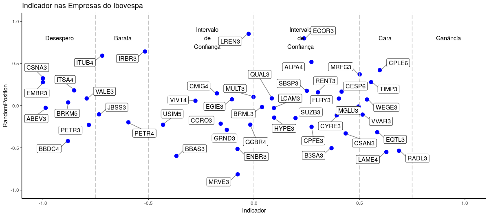

Após ler **"A Random Walk Down Wall Street"**, de Burton Malkiel e **"O Investidor Inteligente"**, de Benjamin Graham, decidi começar a operar na renda variável. 

Para analisar empresas de forma rápida e relativamente detalhada, eu utilizo frequentemente o site [Fundamentus](https://www.fundamentus.com.br/). É possível obter informações dos balanços das empresas, indicadores contábeis, como Liquidez Corrente,
ROE, Dividend Yield; e também indicadores de mercado, como P/L, EV/EBITDA, etc.

Os métodos ensinados pelos "Value Investors" e, em especial, Graham e Malkiel, enfatizam que constantes considerações
das flutuações de preços de curto prazo atrapalham mais do que ajudam o investidor no processo de decisão de
compra ou venda de um ativo. 

Para eles, o mais importante é estabelecer critérios que possibilitem a seleção de empresas com quadro financeira forte,
relativamente grandes, em termos de mercado de atuação, pagadoras de dividendos ininterruptos e, sobretudo, com um preço razoável. 

Os indicadores contábeis e de mercado tradicionalmente utilizados para avaliar se uma  ação está barata ou cara são o Preço sobre o Lucro por Ação (P/L), 
o Preço sobre o Valor Patrimonial (P/VPA), o P/L com o lucro por ação médio dos últimos 3 anos contábeis,
o P/L médio do setor de atuação da empresa e o P/L médio do mercado. Vale ressaltar que não existe um indicador atemporal 
para todo tipo de negócio, bem como não existe um valor universal para os indicadores que permita classificar um ação entre barata e cara. 

No entanto, fiquei interessado em saber se é possível determinar se uma ação está
cara ou barata através de um indicador não-contábil. Coincidentemente, esta ideia surgiu ao analisar os dados
do site Fundamentus. Resolvi utilizar os preços mínimo e máximo nas últimas 52 semanas e o seu preço corrente como *inputs* desse indicador, ainda imaginário.

O desafio estava feito: Desenvolver um indicador que utilize apenas os preços mínimo, corrente e máximo para determinar se uma ação está "barata" ou "cara". Este indicador deve ser:

**1** - *Insensível aos preços de diferentes ações*; 

**2** - *Comparável entre diferentes ações*;

**3** - *Limitado a uma escala definida*;

# Referências
Existem alguns indicadores técnicos, tais como IFR e MACD, que são capaz de identificar o poder das forças compradores *(bullish)* e vendedoras *(bearish)* de uma ação. Talvez o indicador técnico que mais se aproxime do indicador que busco criar seja o **[Averate True Range (ATR])**(https://www.investopedia.com/terms/a/atr.asp), ou Verdadeira Amplitude da Variação. 

Em resumo, o ATR é um indicador que mensura a volatidade de um ativo em um determinado período com base em três parâmetros: O preço máximo do ativo no pregão (H), o preço mínimo no pregão (L) e o preco de fechamento do pregão anterior (P). Ele é calculcado da seguinte forma:
\begin{equation}
True Range = Max[(H-L), |(H-P)|, |(P-L)|]
\end{equation}
\begin{equation}
Average True Range = \sum_{i=1}^{n} True Range_i
\end{equation}

Usualmente, o valor do ATR é calculado utilizando os valores de *True Range*  de 14 pregões anteriores, podendo ser utilizando os valores de várias frequência de tempo (intraday, diária, semanal etc.). Para mais informações sobre este indicador, visite a página do [*Investopedia*](https://www.investopedia.com/terms/a/atr.asp).

A partir do insight gerado pela formulação do ATR, o indicador proposto segue uma construção semelhante.

# A construção do indicador
Dadas as três informações disponíveis, preços mínimo e máximo (ult. 52 semanas) e o preço corrente, podemos afirmar que:
\begin{equation}
P \in [P_{min}, P_{max}]
\end{equation}

\begin{equation}
P_{mediano} = \frac{P_{max} + P_{min}}{2}
\end{equation}

O tamanho do intervalo é dado por:
\begin{equation}
\sigma = P - P_{min}
\end{equation}

Desse modo, podemos construir um indicador normalizado, tal que:
\begin{equation}
I(P,P_{mediano},\sigma) = \frac{P - P_{mediano}}{\sigma} \in [-1,1]
\end{equation}

Usando quantis pertencentes ao intervalo **[-1,1]**, estabelecemos os limites $L = (-1, -0.75, -0.5, 0, 0.5, 0.75, 1)$, dos quais cada valor dos limites do intervalo terá um significado que será explorado na próxima seção.

# Exemplo: Petrobrás, Lojas Renner e Banco do Brasil
Podemos obter os preços mínimo e máximo das últimas 52 semanas e o preço de fechamento do último pregão dessas empresas de muitas formas. Uma delas é acessar o site da Fundamentus e coletá-las manualmente. Usando linguagens de programação, temos  o pacote  **BatchGetSymbols** para o R, e a biblioteca **Quandl**, para Python.

As cotações dessas três ações, no dia 28/02, foram:

|           Ativo          | Preço Mínimo | Preço | Preço Máximo |
|:------------------------:|:------------:|:-----:|:------------:|
| Petrobrás (PETR4)        |     23,49    | 25,34 |     30,81    |
| Lojas Renner (LREN3)     |     36,81    | 53,30 |     60,87    |
| Banco do Brasil (BBAS3)  |     42,28    | 46,86 |     53,56    |

 Calculando os valores do preço mediano, do sigma e, por fim, do indicador usando os dados da tabela acima:
 
|           Ativo          | Preço Mediano | Sigma |  I(.) |
|:------------------------:|:-------------:|:-----:|:-----:|
| Petróbras (PETR4)        |     27,15     |  1,85 | -0.49 |
| Lojas Renner (LREN3)     |     48,84     | 16,49 |  0.37 |
| Banco do Brasil (BBAS3)  |     47,92     |  4,58 | -0.18 |
 
 A ideia do indicador $I(P,P_{mediano},\sigma)$ é estabelecer um valor númerico dentro do intervalo entre -1 e 1, onde $I(.) = -1$ indica um preço corrente igual ao menor preço das últimas 52 semanas e, $I(.) = 1$ indica um preço corrente igual ao preço máximo das últimas 52 semanas. 
 
O resultado gerado pelo indicador pode ser interpretado com um exemplo: Tenha uma ação cujos preços mínimo, mediano, corrente e máximo geram um valor para o indicador de -0.75. Então, esta ação encontra-se 75% mais próximo ao seu mínimo das últimas 52 semanas, relativo ao seu preço corrente.

 Um melhor maneira de analisar as informações geradas é a partir de um gráfico:
 
 

Havíamos comentando o que significam os valores dos quintis definidos nos intervalos. Esses valores geram sub-intervalos nos quais se encontram o valor do indicador, relativo ao seu preço mínimo, mediano, corrente e máximo. Logo, cada sub-intervalo corresponde uma intervalo quintil, onde a posição do valor do indicador nesses intervalos representa a condição subjetiva do ativo, naquele período de tempo. 
 
 Assim, uma ação cujo valor do indicador esteja entre -0.75 e -0.5 pode ser considerada **barata** e, uma ação cujo valor do indicador se aproxima de 1 tende a ter um grau de fator especulativo e, assim, estará **muito cara**. As ações da Petrobrás, Lojas Renner e Banco do Brasil, segundo o indicador, estão dentro do intervalo de confiança, ou seja, estão dentro das flutuações normais do Mercado. A posição do **eixo-y** dos pontos representa um ponto aleatório no intervalo de **[-1,1]**, não tendo significado matemático.


# Exemplo: Empresas do Índice Ibovespa (29-02-2019)

Reproduzindo o exemplo apresentado acima para algumas empresas que compõem do índice Ibovespa, podemos pular a explicação e ir direto analisar o gráfico:

 


 O gráfico apresenta os valores do indicadores de 49 empresas que compõem o índice Ibovespa. Cerca de 60% das empresas encontram-se no intervalo de confiança, definido pelo intervalo **[-0.5,0.,5]**. Outros 24% encontram-se na região "Barata" ou "Desespero". Já os demais estão na região "Cara". Vale ressaltar que o conceito de *caro* e *barato* utilizando é o quão próximo o preço corrente está dos preços máximo e mínimo, respectivamente. Nesse sentido, podemos considerar que o índice Ibovespa está dentro dos limites das variações de preço esperadas por um mercado de renda variável. 
 
 Algo interessante para ser testado no futuro é verificar a distribuição empírica do valor do indicador considerando outros eixos temporais, seja os preços mínimos e máximos dos últimos 30 pregões ou dos últimos 10 anos. 
 
 Para finalizar, o código utilizado para gerar as informações e o gráfico encontram-se abaixo:
 
 ```r
 library(BatchGetSymbols)
 library(ggplot2)
 library(ggrepel)
 
 EstimadorPontual <- function(empresa){
  data <- BatchGetSymbols(tickers = empresa,
                          bench.ticker = '^BVSP',
                          first.date = (Sys.Date() - 252),
                          last.date = Sys.Date()) 
  
  pp <- data$df.tickers[complete.cases(data$df.tickers),]
  pp <- data.frame('data'=pp$ref.date, 'acao'=pp$ticker, 'preco'=pp$price.close)
  last_price <- pp$preco[nrow(pp)] 
  p.max <- max(pp$preco)
  p.min <- min(pp$preco)
  p.med <- (p.max+p.min)/2
  sigma <- p.max-p.med
  z <- (last_price-p.med)/sigma
  return(z)
  }
  
  setores <- list('petrobras' = c("PETR3", "PETR4"),
                'imobiliario' = c('BRML3','CCRO3','CYRE3','ECOR3','MRVE3','MULT3'),
                'transporte_telecom' =  c('EMBR3','RENT3','SBSP3','TIMP3','VIVT4'), 
                'energia' = c('CESP6','CMIG4','CPFE3','CPLE6','ENBR3','EQTL3','EGIE3','WEGE3'),
                'basico' = c('BRKM5','CSNA3','GGBR4','SUZB3','USIM5','VALE3'),
                'consumo' = c('VVAR3', 'MGLU3', 'LREN3', 'JBSS3', 'GRND3','LCAM3', '          ALPA4','ABEV3','BRFS3','CSAN3','HYPE3','LAME4','MRFG3','FLRY3','QUAL3','RADL3'), 
                'financeiro' = c('B3SA3','BBAS3','BBDC4','ITSA4','ITUB4','IRBR3'))
                
empresas <- as.vector(unlist(setores))
empresas <- as.vector(sapply(empresas, function(x) paste0(x, '.SA')))
zs <- sapply(empresas, function(x) EstimadorPontual(x))
df <- data.frame(sapply(zs,c))
df <- data.frame('Empresas' = rownames(df), 'Indicador' = df$sapply.zs..c.)
df$Empresas <- gsub('.{3}$', '', df$Empresas)
df$RandomPosition <- rnorm(nrow(df), 0, 0.3)
ggplot(df, aes(x= Indicador, y = RandomPosition)) + 
  geom_point(color = "blue", size = 3) +
  ylim(c(-1,1)) + 
  xlim(c(-1,1)) + 
  annotate("text", x = c(-0.921,-0.621,-0.221,0.221,0.621,0.921), y = 0.8,
           label = c("Desespero", "Barata", "Intervalo\nde\nConfiança",
                     "Intervalo\nde\nConfiança","Cara","Ganância")) +
  geom_vline(xintercept = c(-0.75, -0.5, 0, 0.5, 0.75),colour="grey", linetype = "longdash") + 
  geom_label_repel(aes(label = Empresas),
                   box.padding   = 0.35, 
                   point.padding = 0.5,
                   segment.color = 'grey50') +
  ggtitle("Indicador nas Empresas do Ibovespa") +
  theme_classic()

 ```


