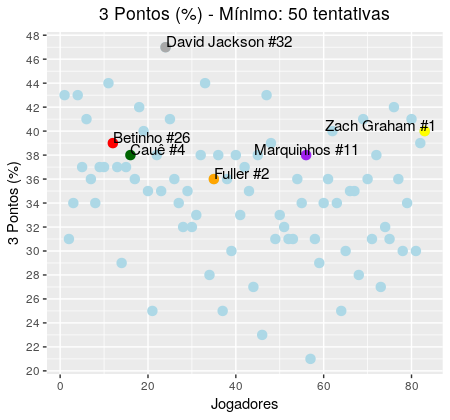

   Repetindo a dose do ano passado, a [Liga Nacional de Basquete](http://lnb.com.br/) escolheu os jogadores que participarão da premiação 'Melhores do Ano'. A análise que eu farei irá refleter apenas minha opinião pessoal. O objetivo da fazer uma análise nunca tem como fim o ranqueamento dos jogadores, mas cumpre apenas o propósito de ser um meio de transmitir mais informação sobre os jogadores e suas estatísticas. Basquete não é ciência e não deve ser.
   
  As estatísticas foram coletadas no site da NBB. Para quem tiver interesse na área de programação e nas técnicas de web-scrapping, o [post da análise dos jogadores](https://pedrohcrocha.github.io/web-scrape-lnb) apresenta os passos necessários para extrair os dados usando a linguagem de programação R. 
  Sem mais delongas, vamos dar início as seleções. Uma novidade é o Shiny App que criei para coletar as informações mais rapidamente. O nome dele é [Big Data Basquete](https://bigdatabasquete.shinyapps.io/BigDataBasquete/). Vale a pena dar uma olhada!
  
  Seguirei a mesma ordem das classificações passadas: Melhor Sexto Homem, Melhor Armador, Melhor Pivô, Melhor Ala e as demais, encerrando com o Melhor Jogador.
    
Melhor Sexto Homem
=====
Os concorrentes nessa categoria são: [Alexey #4](http://lnb.com.br/atletas/alexey-thiago-pereira-borges/), da Equipe Mogi, [Léo Demétrio #71](https://lnb.com.br/atletas/leonardo-dem%c3%a9trio/), do Flamengo e [Vitão #10](https://lnb.com.br/atletas/victor-andr%C3%A9-camilo-da-silva/), do Paulistano. O primeiro é ala, o segundo Ala/Pivô e o terceiro Pivô. Desse modo, não podemos compará-los diretamente. 

O critério principal para a seleção de *Melhor Sexto Homem* deve ser o quão bem o jogador que vem do banco consegue preencher o espaço dos astros em sua posição. A estatística **Plus/Minus**, que mede a diferença de pontuação quando jogador estava em quadra, é a métrica ideal para avaliar essa categoria.
  
| Jogador          | Equipe     | Jogos | Posição  | Min/JO | Min/JO (Desvio) | Plus/Minus (Média) | Plus/Minus (Desvio) |
|------------------|------------|-------|----------|--------|:---------------:|:------------------:|:-------------------:|
| Alexey #4        | Mogi       | 7     | Armador  | 28.5   |       7.36      |        1.57        |         6.66        |
| Léo Demétrio #71 | Flamengo   | 24    | Ala/Pivô | 19.5   |       14.2      |        2.72        |         9.70        |
| Vitão # 10       | Paulistano | 25    | Pivô     | 23.2   |       16.1      |        4.70        |         9.98        |

Um bom indicativo para descobrir um sexto homem de qualidade é o tempo de quadra. Se ele começa no banco e joga uma quantia consistentemente alta de minutos por jogo, então ele é um titular disfarçado, assim como foram Manu Ginóbilli e James Harden, durante a fase em Oklahoma. Alexey #4 joga quase como um titular, ficando em quadra por quase 30 minutos por jogo com um desvio de 7 minutos. Mas como jogou apenas 7 jogos (devido a lesão), ele já está desqualificado, nos meus olhos. Demétrio e Vitão jogam aproximadamente 20 minutos por jogos, mas o maior desvio de Min/JO de Vitão sugere que ele passe bem mais tempo em quadra do que Demétrio. 
  No quesito Plus/Minus, quem leva a vantagem é Demétrio #71, do Flamengo. Porém, é necessário olhar a consistência do jogador. Para isso, olhamos também o desvio-padrão do Plus/Minus. Comparando os dois, Demétrio é mais consistente e possui um maior Plus/Minus. Evidentemente, esses valores são um reflexo de jogar no Flamengo, time que terminou a fase de classificação como líder.  
  
  
  
  Porém, devemos olhar para outras estatísticas para fundamentar a decisão. Uma maneira de sumarizar várias medidas é usando as estatísticas avançadas. Uma boa estatística para avaliar o sexto homem é Usage Rate (UR), métrica que avalia o quanto da atividade de um time envolve um jogador. Pela tabela abaixo, Didi #7 possui o maior Usage Rate, no 85º percentil. Porém, isso é não algo positivo, pois jogadores com mesmo UR, tais como Balbi #6, do Flamengo, com um UR de 21.59 e JP Batista #13, de Mogi, com 21.22 de Usage Rate têm produção muito superior que a de Didi #7. 
  
| Jogador   | Equipe      | Jogos | Min/JO | Posição | Idade | UR    | Percentil |
|-----------|-------------|-------|--------|---------|-------|-------|-----------|
| Alexey #4 | Sesi Franca | 26    | 21.00  | Armador | 24    | 16.39 | 45.04     |
| Davi #5   | Flamengo    | 26    | 20.35  | Armador | 27    | 15.03 | 29.07     |
| Didi #7   | Sesi Franca | 22    | 20.32  | Ala     | 20    | 21.28 | 85.14     |
 
  A eficiência será o último critério de seleção. Esta estatística dará a informação sobre a performance do jogador em relação a todas as estatísticas básicas (Pontos, Rebotes, Assistências, Tocos e Bolas roubadas). Alexey #4, nesse quesito, foi o melhor colocado, ocupando o 73º percentil. Para efeito de comparação, Alex Garcia #10, da equipe Bauru, tem um EFF de 9.91.
 
| Jogador   | Equipe      | Jogos | Min/JO | Posição | Idade | EFF   | Percentil |
|-----------|-------------|-------|--------|---------|-------|-------|-----------|
| Alexey #4 | Sesi Franca | 26    | 21.00  | Armador | 24    | 10.69 | 73.42     |
| Davi #5   | Flamengo    | 26    | 20.35  | Armador | 27    | 6.96  | 54.10     |
| Didi #7   | Sesi Franca | 22    | 20.32  | Ala     | 20    | 9.04  | 65.70     |
  
  Se isso fosse uma redação do ENEM, eu começaria com 'Portanto, etc ...'. Mas, como não é, o meu voto vai para  **Alexey #4** para Melhor Sexto Homem do ano. Ele teve o 2º melhor Plus/Minus, o 2º maior Usage Rate, a melhor eficência entre os candidatos, bem como, para quem assistiu ele jogar durante o ano, uma postura de armador titular em quadra. 
  
Melhor Armador
======
Na categoria Melhor Armador os competidores são: [Balbi #6](http://lnb.com.br/atletas/franco-nicolas-balbi/), do Flamengo, [Georginho #14](https://lnb.com.br/atletas/george-lucas-alves-de-paula/), do São Paulo e [Parodi #21](https://lnb.com.br/atletas/luciano-parodi-gonzalez/), do Sesi/Franca. 
   
Para começar a analisar os armadores na disputa, um bom caminho é compararmos a estatística pela qual os armadores são mais conhecidos, a *assistência*. Balbi está em sua segunda temporada pelo Flamengo e com mais entrosamento com a equipe, imagino que o número de assistências tenha aumentando. Parodi chegou num time de Franca com um armador já estabelecido em Helinho, mas não lhe faltaram jogadas. E Georginho, em sua primeira temporada com o São Paulo, foi tudo, inclusive armador, liderando o SPFC em assistências, rebotes, roubadas de bola e eficiência, e ficando em segundo lugar em tocos.

| Jogador       | Equipe    | Jogos | Min/JO | Assistência | Economy | Eficiência | PIR   |
|---------------|-----------|-------|--------|:-----------:|---------|------------|-------|
| Balbi #6      | Flamengo  | 24    | 29.0   |     7.41    | 6.38    | 13.5       | 22.87 |
| Georginho #14 | São Paulo | 26    | 38.0   |     7.46    | 6.00    | 24.08      | 38.90 |
| Parodi #23    | Franca    | 20    | 22.5   |     4.0     | 3.05    | 13.01      | 18.12 |
   
  Georginho #14 é um ponto extremo do ponto de vista de minutos por jogo, enquanto os outros dois candidatos são mais compensados. Os dados da tabela acima ajudam a excluir Parodi #23 da discussão. O motivo principal é a estatística [*Economy*](https://en.wikipedia.org/wiki/Economy_(basketball), que é uma medida de eficiência de jogadores que iniciam as jogadas da equipe, tradicionalmente os armadores. Um bom armador é eficiente. Não apenas em relação as suas decisões de passe, mas em todos os aspectos que o rodeiam durante o jogo. Assim, a estatística *Eficiência* é uma boa métrica para avaliar os candidatos. A estatística *PIR (Performance Index Rating)* é uma medida mais robusta de eficiência que abrage interações entre as características ofensivas e defensivas que a *Eficiência* tradicional não consegue captar.
  
  Resta então a seguinte charada: Se um jogador é o melhor jogador da liga (veremos adiante), e ele joga na posição armador, então seria esse jogador o melhor armador da Liga? No vácuo, sim! Desse modo, o prêmio de Melhor Armador do Ano vai para **Georginho #14**. Em um segundo lugar muito próximo, o mérito vai para **Balbi #6**.
  
 
Melhor Pivô
======  
   Os classificados para a categoria são: [Hettsheimeir #30](https://lnb.com.br/atletas/rafael-hettsheimeir/)e [Lucas Dias #9](http://lnb.com.br/atletas/lucas-dias-silva/), do Sesi/Franca; [Olivinha #16](http://lnb.com.br/atletas/carlos-alexandre-rodrigues-do-nascimento/), do Flamengo; [Nesbitt #25](https://lnb.com.br/atletas/david-ahmad-nesbitt/), ambos do Flamengo; [D.Scott #22](https://lnb.com.br/atletas/devon-henry-scott/), do Minas, e [Gerson #21](https://lnb.com.br/atletas/gerson-do-esp%c3%adrito-santo-j%c3%banior/), de Rio Claro Basquete.
   
   
   Uma habilidade quase que indispensável para o jogo moderno é o chute de 3 para os ala/pivôs e pivôs. Um chute de 3 respeitável (pelo menos, 33%) abre espaço na quadra e permite novas estratégias de jogo, beneficiando especialmente infiltradores (slashers) com um bom passe. Permite também que os times possam usufruir do Pick-and-Pop, no qual o jogador que faz o corta-luz, geralmente um pivô, gira para linha dos 3. Mas os pivôs com vantagem física e habilidades refinadas perto da cesta ainda são muito valiosos na liga brasileira (JP Batista, um excelente jogador dentro do garrafão, ganhou MVP ano passado). Para ter uma dimensão da diferença dos estilos de jogos que um pivô pode ter, tenha os gráficos dos arressos de Lucas Dias e Dennis Scott:
   
 
 

   Os pivôs estão também associados a última linha de defesa de um time, de modo que o pivô deve ter o maior número de rebotes e tocos de um time. 
   
   
   
   E, entre os pivôs da Liga, o perfil já se altera. Lucas Dias #13 desce para o 68º percentil, seguido de Cipolini #15, no 75º percentil. Olivinha #16 fica no 84º percentil, enquanto que D.Nunes #24 e Varejão #17 encontram-se no 91º e 93º percentils, respectivamente.
   
   
   
   Filtrando para rebote defensivos, JP Batista #13 e D.Nunes #24 estão na liderança entre os candidatos, com aproximadamente 5.5 rebotes defensivos por jogo.
   
   
   
   Nos rebotes ofensivos, JP Batista #13 é o 1º lugar entre os outros concorrentes e 2º na liga, atrás apenas de Toledo #13, da equipe de Pinheiros. 
   
   
   
   É também de se esperar que um pivô projeta o garrafão, sendo, na maioria dos casos, a última linha de defesa de um time. Para isso, *tocos* são uma estatística simples mas que informa bastante sobre posicionamento defensivo, tempo de bola e habilidade defensiva.
   
   Entre os jogadores da Liga, a maioria dos concorrentes estão acima do 80º percentil, exceto Olivinha #16, porém, neste caso, devemos ter uma visão além do dados. Varejão #17, que também joga no Flamengo, ocupa essa função de 'protetor do garrafão', enquanto o papel de Olivinha #16 é ser um defensor mais versátil, capaz de marcar tanto pivôs e quanto ala/armadores, muito parecido com [Draymond Green](https://pt.wikipedia.org/wiki/Draymond_Green). 
   
| Jogador        | Equipe      | Min/JO | Idade | Faltas/JO | TO/JO | Percentil |
|----------------|-------------|--------|-------|-----------|-------|-----------|
| Cipolini #15   | Sesi Franca | 23.46  | 33    | 2.04      | 0.27  | 79.71     |
| D. Nunes #24   | São José    | 31.76  | 32    | 2.56      | 0.52  | 92.27     |
| JP Batista #13 | Mogi        | 31.38  | 38    | 2.54      | 0.57  | 94.20     |
| Lucas Dias #9  | Sesi Franca | 30.48  | 24    | 2.56      | 0.96  | 97.58     |
| Olivinha #16   | Flamengo    | 19.50  | 36    | 1.54      | 0.07  | 51.69     |
| Varejão #17    | Flamengo    | 19.54  | 37    | 2.04      | 0.37  | 88.40     |

   Para tentar captar as estatísticas do modelo de pivô moderno, que joga dentro do garrafão, participa de corta-luz com frequência, mas que também joga bastante na linha dos 3, devemos utilizar a estatística avançada *Effective Field Goal Percentage*, ou *porcentagem de arremesso efetiva*. Para entender como ela funciona, imagine um jogador X acerta 4 de 10 arremessos, com 2 acertos de 3 pontos e 2 acertos de 2 pontos. Logo, 6 pontos vindos de arremessos da linha de 3 e 4 pontos vindo de arremessos de 2 pontos, totalizando 10 pontos. Agora, imagine outro jogador Y acerta 5 de 10 arremessos e os 5 acertos foram da área de 2 pontos. Assim, cada jogador teria 10 pontos para 10 arremessos e, logo, a mesma porcentagem de pontos por arremesso, isto é, a mesma effective field goal percentage. Para ver mais, veja a outra [postagem](https://pedrohcrocha.github.io/web-scrape-lnb).
   
   Cipolini #15 lidera os candidatos, ocupando o 96º percentil entre os jogadores da liga e o 97º percentil. Olivinha #16 e Lucas Dias #9, jogadores que tradicionalmente operam fora da linha dos 3, tem altos EFG%. No entanto, JP Batista #13, que arremessou apenas três bolas de 3 pontos durante a temporada, estar no 90º percentil entre os jogadores da liga é impressionante.
   E é por isso e por todos os outros critérios que meu voto para *Melhor Pivô do Ano* vai para **JP Batista #13**. Como ganhador do segundo posto de *Melhor Pivô do Ano*, meu voto vai para **Lucas Dias #9**, pelo enorme potencial que ele demonstrou ter e pelo papel que ele desempenhou na equipe de Sesi/Franca. 

| Jogador        | Equipe      | JO  | EFG (%) | Percentil (Liga) | Percentil (Pivôs) |
|----------------|-------------|-----|---------|:----------------:|:-----------------:|
| Cipolini #15   | Sesi Franca | 26  | 62.56   |       96.52      |       97.77       |
| D. Nunes #24   | São José    | 25  | 54.50   |       67.82      |       71.11       |
| JP Batista #13 | Mogi        | 26  | 58.33   |       90.43      |       91.11       |
| Lucas Dias #9  | Sesi Franca | 25  | 59.02   |       93.91      |       93.33       |
| Olivinha #16   | Flamengo    | 26  | 57.91   |       89.56      |       88.88       |
| Varejão #17    | Flamengo    | 24  | 50.27   |       40.00      |       42.22       |

Melhor Ala 
======
   A posição de *ala* é conhecido por aglomerar os grandes pontuadores de qualquer liga de basquete. E na NBB, não é diferente. A disputa de Melhor Ala do Ano é recheada de veteranos, com apenas um novato. Os concorrentes são: [Betinho #26](http://lnb.com.br/atletas/jos%C3%A9-roberto-nardi-duarte/), [Cauê #4](http://lnb.com.br/atletas/cau%C3%AA-borges-dos-santos/), [David Jackson #32](http://lnb.com.br/atletas/david-wayne-jackson-jr/), [Fuller #2](http://lnb.com.br/atletas/kyle-alejandro-fuller/), [Marquinhos #11](http://lnb.com.br/atletas/marcus-vinicius-vieira-de-sousa/) e [Zach Graham #1](http://lnb.com.br/atletas/zachary-darnell-graham/).
   
   Verificando os *pontos por jogo*, salta aos olhos a similaridade do basquete brasileiro em relação as outras ligas internacionais no que diz respeito da pontuação vinda dos alas. Todos, exceto Betinho #26, encontram-se na casa do 90º percentil. Entre os concorrentes, temos Fuller #2 liderando a liga em pontos e Zach Graham #1 vindo em 2º lugar. Outro padrão evidente é a idade dos concorrentes; o grupo tem idade média de 34 anos, não que isso importe muito. 
   
| Jogador           | Equipe      | Min/JO | Idade | PTS/JO | Percentil |
|-------------------|-------------|--------|-------|--------|-----------|
| Betinho #26       | Pinheiros   | 21.80  | 40    | 11.84  | 80.67633  |
| Cauê #4           | Botafogo    | 34.20  | 31    | 13.95  | 91.78744  |
| David Jackson #32 | Sesi Franca | 29.66  | 37    | 17.37  | 98.55072  |
| Fuller #2         | Corinthians | 32.34  | 27    | 21.30  | 100.00000 |
| Marquinhos #11    | Flamengo    | 26.92  | 40    | 15.42  | 94.20290  |
| Zach Graham #1    | Brasília    | 36.31  | 30    | 19.13  | 99.03382  |

   No basquete moderno, um ala deve ter em seu arsenal ofensivo um bom chute da linha de três pontos. Um ala que tem esse artifício abre o espaço na quadra, permitindo que o armador ou ala/armador possa infiltrar com mais facilidade, como também ajuda o pivô a jogar na área do garrafão sem ter o perigo constante de dobrar a marcação nele. 
   
   Entre os jogadores que arremessaram mais que 50 bolas de três durante a temporada, David Jackson #32 lidera absoluto com uma (ridícula) porcentagem de 47% dos três pontos. A maioria dos candidatos, como a restante do grupo selecionado, encontra-se na faixa de 32% e 38%. 
   
   
   
   Outra métrica importante de ser analisada no caso dos alas é a *True Shooting (TS)*, ou, *Verdadeiro Arremesso*. Ela avalia a eficiência de todos tipos de arremessos, seja de 2 pontos, 3 pontos ou lances livres. Do ponto de vista técnico, uma medida alta de True Shooting indica que o jogador escolhe arremessos de alta porcentagem e os converte com frequência, isto é, no linguajar do basquete, não "força" cestas em situações difíceis com marcação apertada.
   
   Filtrando para jogadores com pelo menos 20 jogos na temporada, David Jackson #32 lidera o grupo, mas Marquinhos #11 vem logo em seguida, com 62% de True Shooting.
   
   
   
   Na ausência de estatísticas mais específicas da área defensiva, meu voto para *Melhor Ala do Ano* vai para **David Jackson #32**, pela incrível temporada em termos de eficiência - 2º lugar na Liga-, eficácia em arremesso e contribuição tanto ofensiva quanto defensiva para a equipe de Franca. Tudo isso com 37 anos de idade! O segundo voto vai para **Marquinhos #11**, que teve uma boa temporada regular e uma pós-temporada fantástica.
   
   Existem outras categorias na votação de 'Melhor de Ano' que não terão uma análise mais detalhada. Então, todos os votos a partir daqui representarão uma opinião pessoal de espectador:
   
   **Defensor do ano**: VOTO DE PROTESTO: Georginho #14, do São Paulo, deveria estar nessa categoria e deveria receber o prêmio.
   
   **Destaque Jovem**: Didi #7 (Sesi/Franca), Ruivo #4 (Pinheiros) , **Yago #2 (Paulistano)**
   
   **Técnico do Ano**: Gustavo de Conti (Flamengo), **Guerrinha (Mogi das Cruzes)**, Léo Figueiró (Botafogo)
   
   Na escolha de Melhor Jogador da Temporada (MVP), a disputa é acirrada. Por um lado, temos um recém-chegado da liga em Balbi #6 e dois veteranos, JP Batista #13 e DJ #32. Por ser um 'rosto novo' e ter um estilo de jogo esteticamente prazeroso e eficiente, Balbi #6 talvez leve vantagem na corrida. No geral, ele teve uma boa temporada. Mas as temporadas de DJ #32 e JP #13 foram bem superiores, em termos de estatísticas e eficiência, do que a de Balbi #6, o que o exclui da votação.
   Assim, entre JP Batista #13 e David Jackson #32, meu voto vai para **JP Batista #13**, pela alto nível e consistência durante a temporada.
   
   **MVP da temporada** : **JP Batista #13 (Mogi)**, David Jackson #32 (Sesi/Franca), Balbi #6 (Flamengo)

   
